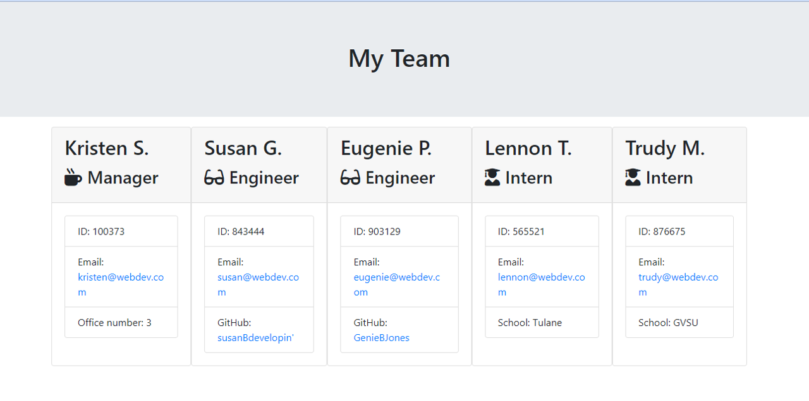

# OOP Team Profile Generator

## Overview
The challenge for this assignment was to create a command-line application that would take user input to generate an HTML webpage displaying employee cards for a development team.

## Description
Access criteria is as follows:

AS A manager 
I WANT to generate a webpage that displays my team's basic info 
SO THAT I have quick access to their emails and GitHub profiles. 

GIVEN a command-line application that accepts user input
WHEN I am prompted for my team members and their information
THEN an HTML file is generated that displays a nicely formatted team roster based on user input

WHEN I click on an email address in the HTML
THEN my default email program opens and populates the TO field of the email with the address

WHEN I click on the GitHub username
THEN that GitHub profile opens in a new tab

WHEN I start the application
THEN I am prompted to enter the team manager’s name, employee ID, email address, and office number

WHEN I enter the team manager’s name, employee ID, email address, and office number
THEN I am presented with a menu with the option to add an engineer or an intern or to finish building my team

WHEN I select the engineer option
THEN I am prompted to enter the engineer’s name, ID, email, and GitHub username, and I am taken back to the menu

WHEN I select the intern option
THEN I am prompted to enter the intern’s name, ID, email, and school, and I am taken back to the menu

WHEN I decide to finish building my team
THEN I exit the application, and the HTML is generated

## Table of Contents

1. [Installation](#installation)
2. [Usage](#usage)
3. [Licenses](#licenses)
4. [Contributing](#contributing)
5. [Tests](#tests)
6. [Questions](#questions)

## Installation
This application is access using node index.js. It is not deployed to a webpage. Please see the package.json for all dependencies that may need to be installed locally. A screenshot of the site is shown below: 

## Usage
To use this application, initialize the folder's command line application and make sure that all appropriate packages are installed. Using the command "node index.js," a user will be presented with a series of prompts in order to create personnel cards for their web development team. After the team manager inputs their information, the user will be asked to add either an engineer or intern or to finish the team. Once the team is assembled, the user can opt to "Finish the team" which will end the prompt cycle and generate an html file named the team's name and located in the dist folder. The html file can then be displayed in the default browser.

## Licenses
This project uses the MIT license. More info about licenses can be found [here](https://choosealicense.com/).

## Contributing
This project is open for contribution but please initiate an issue for any significant changes. 

## Tests
This application passes all tests provided in the folder. The test suite utilizes jest and the dependency is included in the package.json file but will need to be installed locally to access it.

## Questions
The developer can be reached through [email](mikeandkris27@gmail.com) or contacted through [Github](https://github.com/kristensantee) or [LinkedIn](https://linkedin.com/in/kristen-santee).
